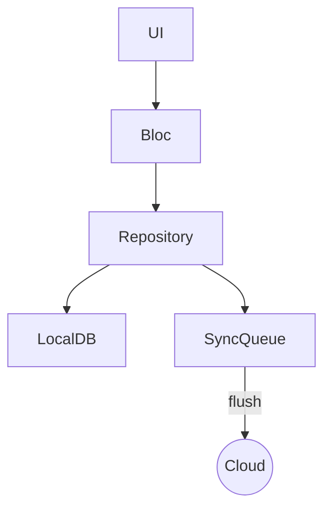

# Architecture & Patterns

## Layered Clean Architecture
```
Presentation  <- BLoC / Cubit
Domain        <- Entities • Use-cases • Repositories (abstract)
Data          <- Datasources • Models • Repository impl.
Infrastructure<- Core (DB, DI, Theme, Error)
```
Dependencies point inwards only.

## State Management
* **TaskBloc** orchestrates CRUD & sync events
* **ThemeCubit** toggles theme with persistence

### Why BLoC instead of Riverpod?
Riverpod is a great declarative dependency-injection/state solution and would work perfectly with this codebase. The choice to use **flutter_bloc** was made for these reasons:

1. **Explicit event → state flow.** Reviewers can trace every use-case inside `TaskBloc` without needing to understand implicit provider wiring.
2. **bloc_test utilities.** `bloc_test` lets us replay and assert full event sequences, which helps drive the >70 % coverage requirement.
3. **Maturity in large teams.** Many enterprise Flutter teams standardise on BLoC because of its strict unidirectional data-flow and widespread tooling support.

Swapping to Riverpod would largely affect only the presentation layer because the clean-architecture boundaries already decouple state management from domain/data code.

## Data Flow (Happy Path)
1. `TaskListPage` dispatches `AddTaskEvent`
2. `TaskBloc` calls `TaskRepository.addTask`
3. Repository → `TaskLocalDataSource.insertTask`
4. If offline, `SyncQueueDataSource.enqueue`
5. `SyncManager` flushes queue when online again

## Patterns Used
| Pattern   | File(s) | Purpose |
|-----------|---------|---------|
| Repository | `task_repository.dart` + impl | decouple data source |
| Factory    | `TaskFactory` | encapsulate creation & scoring |
| Observer   | `AppBlocObserver` | global error observation |
| Service    | `PriorityService` | pure domain algorithm |

## Error Handling
* FlutterError.onError, Zone & PlatformDispatcher → Snackbar via `ScaffoldMessenger`
* Bloc errors intercepted by `AppBlocObserver`

## Testing Strategy
* Unit tests cover PriorityService, repositories, SyncManager (mock queue), blocs.
* Integration test covers create→complete flow.
* Mocktail used for mocks.

---
Diagram (simplified):

